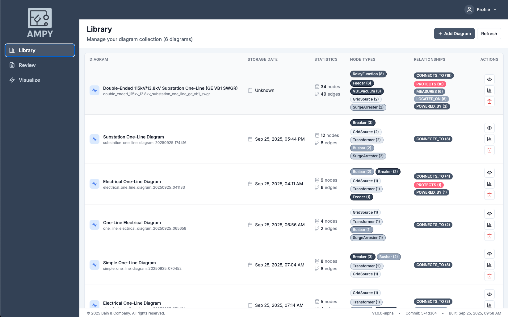
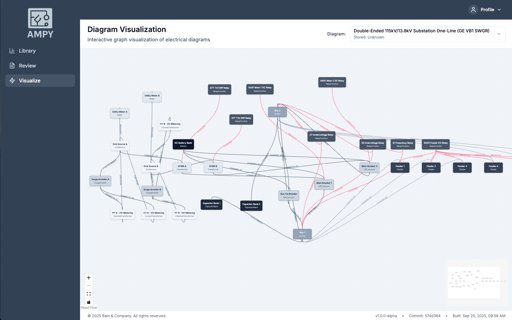

# Electrical Assembly Analyzer

AMPY: An Electrical diagram parsing and electrical assembly graph extraction tool

[](https://www.python.org/downloads/)
[](https://opensource.org/licenses/MIT)
[](https://github.com/astral-sh/ruff)

## About

AMPY Electrical Assembly Analyzer is a specialized tool designed to parse electrical one-line diagrams and extract structured knowledge graphs from them. It's specifically built for electrical engineers, power system analysts, and automation professionals who need to work with electrical substation diagrams and similar power system schematics.





### Key Capabilities

- **LLM-Powered Analysis**: Analyze electrical diagram images using AI (OpenAI, Anthropic, Google Gemini)
- **Web Application**: Modern React-based frontend with FastAPI backend for interactive analysis
- **Real-time Graph Visualization**: Interactive node-edge graphs using React Flow
- **Structured Data Extraction**: Convert electrical diagrams into machine-readable knowledge graphs
- **Component Analysis**: Identify and catalog electrical components (transformers, breakers, buses, relays, etc.)
- **Topology Analysis**: Map electrical connections and relationships between components
- **Engineering Calculations**: Extract and validate short circuit analysis, breaker specifications, and other engineering data
- **Flexible Querying**: Query specific components, connections, or system characteristics
- **Rich Visualization**: Generate summaries and reports with detailed component breakdowns
- **Neo4j Integration**: Store and query electrical diagrams in Neo4j graph database (via Docker Compose)

### Supported Components

- **Power Sources**: Grid sources, generators
- **Transformers**: Power transformers with ratings and specifications
- **Switchgear**: Breakers, switches, bus ties
- **Protection**: Relays, current transformers, potential transformers
- **Loads**: Feeders, capacitor banks, loads
- **Control Systems**: Batteries, meters, control circuits

## QuickStart

### Prerequisites

- Python 3.9 or higher
- [uv](https://github.com/astral-sh/uv) package manager
- Docker and Docker Compose (for Neo4j database)

### Installation

1. **Install uv** (if not already installed):

   ```bash
   curl -LsSf https://astral.sh/uv/install.sh | sh
   ```

2. **Clone and setup the project**:

   ```bash
   git clone <repository-url>
   cd EA-Analyzer
  ```

3. **Set up environment variables** (for LLM integration):

   ```bash
   # Create .env file with your API keys
   cp .env.example .env
   # Edit .env file with your actual API keys
   ```

   See [ENV_SETUP.md](ENV_SETUP.md) for detailed environment configuration.

4. **Verify installation**:

   ```bash
   make check
   ```

### Basic Usage

**Analyze an electrical diagram image using LLM**:

```bash

# Start all of the components
make run 

# Analyze image and extract structured data
./ea-analyzer-cli.sh analyze substation.png

# Analyze and store in Neo4j
./ea-analyzer-cli.sh analyze substation.png --store
```

**Parse and summarize an existing diagram**:

```bash
./ea-analyzer-cli.sh summary data/one-line-knowledge-graph.json
```

**Store diagram in Neo4j database**:

```bash
./ea-analyzer-cli.sh store data/one-line-knowledge-graph.json
```

**Query the database**:

```bash
./ea-analyzer-cli.sh neo4j summary
./ea-analyzer-cli.sh neo4j protection-schemes
```

## Quick Start

### CLI Usage

Get up and running quickly with these essential commands:

```bash
# Check system status and prerequisites
./ea-analyzer-cli.sh check

# Analyze an electrical diagram image with LLM
./ea-analyzer-cli.sh analyze substation.png

# Analyze and store in Neo4j database
./ea-analyzer-cli.sh analyze substation.png --store

# View stored diagrams
./ea-analyzer-cli.sh neo4j list

# Export diagram to PNG
./ea-analyzer-cli.sh neo4j export 1

# Run complete demo
./ea-analyzer-cli.sh demo
```

### Web Application

Launch the complete web application with a single command:

```bash
# Build and run the web application (frontend + backend + Neo4j)
make run

# For development with hot reload (recommended for UI work)
make run-dev

# Access the application
# Frontend:     http://localhost:3000
# Backend API:  http://localhost:8000
# API Docs:     http://localhost:8000/docs
# Neo4j:        http://localhost:7474

# Stop the web application
make stop

# For development mode
make stop-dev
```

**Development Mode Features:**

- **Hot Reload**: Changes to frontend files are reflected immediately
- **File Mounting**: Local files are mounted into the container
- **Development Tools**: Full source maps and debugging support

For detailed frontend development instructions, see [FRONTEND_DEVELOPMENT.md](FRONTEND_DEVELOPMENT.md).

## Detailed Usage

### Command Line Interface

The `ea-parse` command provides several subcommands for different operations:

#### `summary` - Diagram Overview

```bash
ea-parse summary <input_file>
```

Displays comprehensive information about the electrical diagram including:

- Metadata (title, source, extraction date)
- Component statistics (total nodes/edges)
- Component type breakdown
- Connection type analysis
- Engineering calculations status

#### `list-items` - Component Listing

```bash
ea-parse list-items <input_file> [--node-type TYPE] [--edge-type TYPE]
```

Lists all components and connections in the diagram:

- `--node-type`: Filter by component type (e.g., Transformer, Breaker, Busbar)
- `--edge-type`: Filter by connection type (e.g., CONNECTS_TO, PROTECTS, MEASURES)

#### `parse` - File Processing

```bash
ea-parse parse <input_file> [--output OUTPUT_FILE]
```

Processes and optionally saves the diagram:

- `--output, -o`: Save processed diagram to specified file

### Python API

For programmatic access, use the Python API:

```python
from ea_analyzer.parser import ElectricalDiagramParser
from pathlib import Path

# Load a diagram
parser = ElectricalDiagramParser()
diagram = parser.load_from_file(Path("data/one-line-knowledge-graph.json"))

# Get summary statistics
summary = parser.get_summary()
print(f"Total components: {summary['total_nodes']}")
print(f"Total connections: {summary['total_edges']}")

# Query specific components
transformers = diagram.get_nodes_by_type("Transformer")
for tx in transformers:
    print(f"Transformer {tx.id}: {tx.name}")
    print(f"  Ratings: {tx.extra_attrs.get('mva_ratings', 'N/A')} MVA")
    print(f"  HV: {tx.extra_attrs.get('hv_kv', 'N/A')} kV")
    print(f"  LV: {tx.extra_attrs.get('lv_kv', 'N/A')} kV")

# Find connections
connections = diagram.get_edges_by_type("CONNECTS_TO")
for conn in connections:
    print(f"{conn.from_} connects to {conn.to} via {conn.via}")

# Get specific node
tx1 = diagram.get_node_by_id("TX1")
if tx1:
    print(f"TX1 details: {tx1.extra_attrs}")

# Get connections from/to a specific node
from_connections = diagram.get_edges_from_node("TX1")
to_connections = diagram.get_edges_to_node("BUS1")
```

### Data Format

EA Parsing works with JSON files containing electrical diagram knowledge graphs. The format includes:

#### Structure

```json
{
  "metadata": {
    "title": "Diagram Title",
    "source_image": "diagram.png",
    "extracted_at": "2025-01-16T10:30:00Z",
    "notes": ["Additional context"]
  },
  "ontology": {
    "node_types": {
      "Transformer": { "attrs": ["name", "mva_ratings", "hv_kv", "lv_kv"] },
      "Breaker": { "attrs": ["name", "kv_class", "continuous_a"] }
    },
    "edge_types": {
      "CONNECTS_TO": { "attrs": ["via", "notes"] },
      "PROTECTS": { "attrs": ["notes"] }
    }
  },
  "nodes": [
    {
      "id": "TX1",
      "type": "Transformer",
      "name": "Main Transformer",
      "mva_ratings": [12, 16, 20],
      "hv_kv": 115,
      "lv_kv": 13.8
    }
  ],
  "edges": [
    {
      "from": "GS_A",
      "type": "CONNECTS_TO",
      "to": "TX1",
      "via": "HV bushings",
      "notes": "115kV delta"
    }
  ],
  "calculations": {
    "short_circuit": {
      "bus1": {
        "first_cycle_asym_ka": 12.4,
        "one_point_five_cycles_sym_ka": 7.2
      }
    },
    "breaker_spec": {
      "type": "GE VB1 vacuum",
      "kv_class": 13.8,
      "continuous_a": 1200
    }
  }
}
```

#### Key Fields

- **metadata**: Information about the source diagram and extraction process
- **ontology**: Definitions of component and connection types
- **nodes**: Electrical components with their attributes
- **edges**: Connections and relationships between components
- **calculations**: Engineering analysis results (short circuit, breaker specs, etc.)

### Advanced Features

#### Custom Component Types

The system supports custom component types through the ontology definition. Add new types by extending the `node_types` and `edge_types` in your JSON data.

#### Engineering Calculations

Extract and validate engineering calculations including:

- Short circuit analysis (first cycle, interrupting capacity)
- Breaker specifications and ratings
- Transformer ratings and impedance
- Protection coordination data

#### Data Validation

All data is validated using Pydantic models, ensuring:

- Type safety and validation
- Required field checking
- Data consistency
- Error reporting for malformed data

## Neo4j Integration

The Electrical Assembly Analyzer includes comprehensive Neo4j integration for storing and querying electrical diagrams as graph databases. This enables powerful graph-based analysis and querying capabilities.

### Prerequisites

- Neo4j database (version 5.0+)
- Neo4j Python driver (included in dependencies)

### Quick Start with Neo4j

1. **Start Neo4j** (using Docker):

   ```bash
   docker run -p 7474:7474 -p 7687:7687 -e NEO4J_AUTH=neo4j/password neo4j:latest
   ```

2. **Store a diagram in Neo4j**:

   ```bash
   ea-analyze neo4j store data/one-line-knowledge-graph.json
   ```

3. **View stored data summary**:

   ```bash
   ea-analyze neo4j summary
   ```

### Neo4j CLI Commands

#### `neo4j store` - Store Diagram

Store an electrical diagram in Neo4j database.

```bash
ea-analyze neo4j store <input_file> [OPTIONS]

Options:
  --uri TEXT         Neo4j connection URI [default: bolt://localhost:7687]
  --username TEXT    Neo4j username [default: neo4j]
  --password TEXT    Neo4j password [default: password]
  --database TEXT    Neo4j database name [default: neo4j]
  --clear           Clear database before storing
```

#### `neo4j summary` - Database Summary

Show a summary of the stored diagram data.

```bash
ea-analyze neo4j summary [OPTIONS]
```

#### `neo4j protection-schemes` - Protection Analysis

Query and display protection schemes in the diagram.

```bash
ea-analyze neo4j protection-schemes [OPTIONS]
```

#### `neo4j query` - Custom Queries

Execute custom Cypher queries on the stored data.

```bash
ea-analyze neo4j query "MATCH (n:Transformer) RETURN n.id, n.name, n.hv_kv, n.lv_kv" [OPTIONS]
```

### Python API for Neo4j

```python
from ea_analyzer.neo4j_client import Neo4jClient
from ea_analyzer.parser import ElectricalDiagramParser

# Load diagram
parser = ElectricalDiagramParser()
diagram = parser.load_from_file("data/one-line-knowledge-graph.json")

# Store in Neo4j
with Neo4jClient(uri="bolt://localhost:7687", username="neo4j", password="password") as client:
    result = client.store_diagram(diagram)
    print(f"Stored {result['nodes_created']} nodes and {result['relationships_created']} relationships")

    # Query protection schemes
    schemes = client.get_protection_schemes()
    for scheme in schemes:
        print(f"Relay {scheme['relay_id']} protects {scheme['protected_name']}")

    # Custom query
    transformers = client.query_diagram("MATCH (t:Transformer) RETURN t.id, t.name")
    for tx in transformers:
        print(f"Transformer: {tx['t.id']} - {tx['t.name']}")
```

### Graph Schema

The Neo4j integration creates the following graph structure:

- **Nodes**: Each electrical component becomes a node with its type as a label

  - Labels: `GridSource`, `Transformer`, `Breaker`, `Busbar`, `RelayFunction`, etc.
  - Properties: All component attributes (voltage, ratings, specifications, etc.)

- **Relationships**: Electrical connections and functional relationships

  - `CONNECTS_TO`: Physical electrical connections
  - `PROTECTS`: Protection relationships (relays protecting equipment)
  - `MEASURES`: Measurement relationships (CTs/PTs measuring equipment)
  - `CONTROLS`: Control relationships
  - `POWERED_BY`: Power supply relationships
  - `LOCATED_ON`: Physical location relationships

- **Special Nodes**:
  - `Metadata`: Diagram metadata and source information
  - `Ontology`: Node and edge type definitions
  - `Calculations`: Engineering calculation results

### Example Queries

**Find all transformers and their connections:**

```cypher
MATCH (t:Transformer)-[r:CONNECTS_TO]-(connected)
RETURN t.name, t.hv_kv, t.lv_kv, type(r), connected.name
```

**Find protection schemes:**

```cypher
MATCH (relay:RelayFunction)-[r:PROTECTS]->(protected)
RETURN relay.device_code, relay.description, protected.name, protected.type
```

**Find electrical paths between two buses:**

```cypher
MATCH path = (bus1:Busbar {id: "BUS1"})-[*]-(bus2:Busbar {id: "BUS2"})
WHERE ALL(r in relationships(path) WHERE type(r) = "CONNECTS_TO")
RETURN [node in nodes(path) | node.name] as path
```

**Find all components connected to a specific bus:**

```cypher
MATCH (bus:Busbar {id: "BUS1"})-[r:CONNECTS_TO]-(component)
RETURN component.type, component.name, r.via, r.notes
```

### Environment Variables

Configure Neo4j connection using environment variables:

```bash
export NEO4J_URI="bolt://localhost:7687"
export NEO4J_USERNAME="neo4j"
export NEO4J_PASSWORD="your_password"
export NEO4J_DATABASE="neo4j"
```

## Features

- **Parse electrical diagram knowledge graphs from JSON files**
- **Extract structured data about electrical components** (transformers, breakers, buses, etc.)
- **Query and analyze electrical system topology**
- **Command-line interface for common operations**
- **Rich data models using Pydantic for validation**
- **Support for engineering calculations and specifications**
- **Flexible component and connection type definitions**
- **Comprehensive error handling and validation**

## Project Structure

```bash
EA-Parsing/
├── src/
│   └── ea_analyzer/                    # Main Python package
│       ├── __init__.py               # Package initialization
│       ├── models.py                 # Pydantic data models
│       ├── parser.py                 # JSON parsing and data extraction
│       └── cli.py                    # Command-line interface
├── tests/                            # Unit tests
│   ├── __init__.py
│   └── test_parser.py               # Parser tests
├── data/                             # Sample data and images
│   ├── one-line-knowledge-graph.json # Sample electrical diagram
│   └── images/                       # Diagram images
├── pyproject.toml                    # Project configuration
├── README.md                         # This file
└── .gitignore                        # Git ignore rules
```

## Development

### Development Setup

1. **Clone and setup development environment**:

   ```bash
   git clone <repository-url>
   cd EA-Parsing

   # Create virtual environment
   uv venv
   source .venv/bin/activate  # On Windows: .venv\Scripts\activate

   # Install with development dependencies
   uv pip install -e ".[dev]"
   ```

2. **Run tests**:

   ```bash
   # Run all tests
   pytest

   # Run with coverage
   pytest --cov=ea_analyzer --cov-report=html

   # Run specific test file
   pytest tests/test_parser.py -v
   ```

3. **Code quality checks**:

   ```bash
   # Format and lint code with ruff
   ruff check --fix src/ tests/
   ruff format src/ tests/

   # Type checking
   mypy src/
   ```

### Adding New Features

1. **Create a feature branch**:

   ```bash
   git checkout -b feature/new-feature-name
   ```

2. **Make your changes**:

   - Add new functionality to appropriate modules
   - Update tests for new features
   - Update documentation as needed

3. **Test your changes**:

   ```bash
   pytest
   ruff check src/ tests/
   ruff format --check src/ tests/
   mypy src/
   ```

4. **Submit a pull request** with:
   - Clear description of changes
   - Tests for new functionality
   - Updated documentation

### Code Style

This project follows modern Python best practices:

- **Formatting & Linting**: Ruff for comprehensive code analysis and formatting
- **Type hints**: Full type annotation support
- **Documentation**: Google-style docstrings

### Testing

- **Framework**: pytest
- **Coverage**: pytest-cov
- **Test structure**: Mirror source structure in `tests/`
- **Fixtures**: Use pytest fixtures for test data
- **Mocking**: Use unittest.mock for external dependencies

## Examples

### Example 1: Basic Diagram Analysis

```python
from ea_analyzer.parser import ElectricalDiagramParser
from pathlib import Path

# Load diagram
parser = ElectricalDiagramParser()
diagram = parser.load_from_file(Path("data/one-line-knowledge-graph.json"))

# Get overview
summary = parser.get_summary()
print(f"Diagram: {summary['metadata'].get('title', 'Unknown')}")
print(f"Components: {summary['total_nodes']}")
print(f"Connections: {summary['total_edges']}")

# Analyze transformers
transformers = diagram.get_nodes_by_type("Transformer")
for tx in transformers:
    ratings = tx.extra_attrs.get('mva_ratings', [])
    print(f"{tx.name}: {ratings} MVA")
```

### Example 2: Protection Analysis

```python
# Find all protection relationships
protection_edges = diagram.get_edges_by_type("PROTECTS")

for edge in protection_edges:
    relay = diagram.get_node_by_id(edge.from_)
    protected = diagram.get_node_by_id(edge.to)

    if relay and protected:
        print(f"{relay.extra_attrs.get('device_code', 'Unknown')} "
              f"protects {protected.name or protected.id}")
```

### Example 3: Topology Analysis

```python
# Find all connections to a specific bus
bus_connections = diagram.get_edges_to_node("BUS1")
bus_connections.extend(diagram.get_edges_from_node("BUS1"))

print("Bus 1 connections:")
for conn in bus_connections:
    other_node = conn.to if conn.from_ == "BUS1" else conn.from_
    print(f"  {other_node} ({conn.type})")
```

### Example 4: Export Diagram to PNG

```bash
# Export a stored diagram to PNG
./ea-analyzer-cli.sh neo4j export 1 --output my_diagram.png

# Export with custom layout and size
./ea-analyzer-cli.sh neo4j export 1 \
  --output large_diagram.png \
  --layout hierarchical \
  --width 20 \
  --height 16 \
  --dpi 300

# Export with spring layout
./ea-analyzer-cli.sh neo4j export 1 \
  --output spring_layout.png \
  --layout spring
```

## Troubleshooting

### Common Issues

**ImportError: No module named 'ea_analyzer'**

- Ensure you're in the project directory
- Activate the virtual environment: `source .venv/bin/activate`
- Install in development mode: `uv pip install -e .`

**FileNotFoundError when loading data**

- Check that the data file exists
- Use absolute paths or ensure you're in the correct directory
- Verify file permissions

**Validation errors when parsing JSON**

- Check JSON syntax with a JSON validator
- Ensure required fields are present
- Verify data types match expected schema

**CLI command not found**

- Ensure virtual environment is activated
- Reinstall the package: `uv pip install -e .`
- Check that the package is properly installed: `pip list | grep ea-analyzer`

### Getting Help

- **Documentation**: Check this README and inline code documentation
- **Issues**: Report bugs and request features via GitHub issues
- **Discussions**: Use GitHub discussions for questions and ideas

## Contributing

We welcome contributions! Please see our [Contributing Guidelines](CONTRIBUTING.md) for details.

### Quick Contribution Guide

1. Fork the repository
2. Create a feature branch: `git checkout -b feature/amazing-feature`
3. Make your changes and add tests
4. Run the test suite: `pytest`
5. Format your code: `ruff format src/ tests/`
6. Commit your changes: `git commit -m 'Add amazing feature'`
7. Push to your branch: `git push origin feature/amazing-feature`
8. Open a Pull Request

## License

This project is licensed under the MIT License - see the [LICENSE](LICENSE) file for details.

## Acknowledgments

- Built with [Pydantic](https://pydantic.dev/) for data validation
- Uses [Click](https://click.palletsprojects.com/) for CLI interface
- Powered by [Rich](https://rich.readthedocs.io/) for beautiful terminal output
- Managed with [uv](https://github.com/astral-sh/uv) for fast Python packaging
